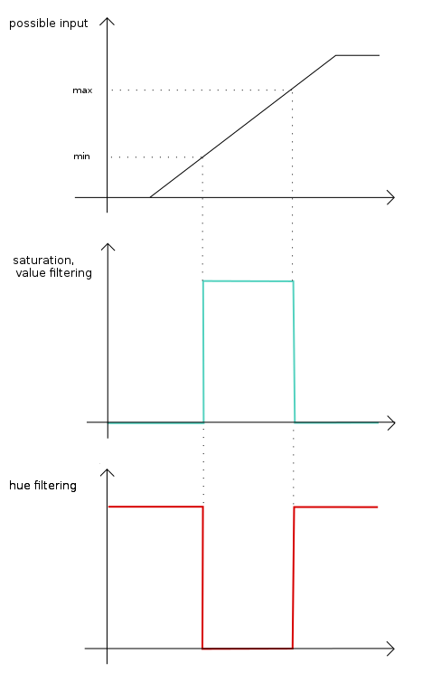

Laser-Grafiti
=============

Usage:
------

1) Find your webcam. (use ``ls /dev``, generally built in webcam will be video0, a plugged in usb cam will be video1)
2) Edit run.sh to reflect your webcam (change the -D 0 parameter)
3) ``./run.sh``
4) Lots of windows will open. the "warp" window is the important one. It should show just the projector. hit 'a' when it does.
5) The windows are closed and the calibration window is open. first tell the program where the laser is. (right click zoom in, left click and drag to draw a circle around laser dot, 'a' to accept)
6) By default it will now attempt to auto calibrate hsv thresholds. the 'laser' window will show how well the calibration worked. The levels can be manually adjusteed with the sliders.
7) When the thresholds are good, hit 'a' to accept. 
8) You are now brought back to the original window and laser tracking will start.
9) At any time hit 'c' to clear, 't' to redo calibration and 'q' to quit

Original Laser Tracker documentation: 

python laser tracker
====================

This is a OpenCV application that applies filters in order to track specific HSV ranges. By default, it tracks a red laser pointer, but it is modular and you can track about whatever you want.

Requirments
-----------

This requires Python2 and the Python wrapper for OpenCV.
It was tested on GNU/Linux distributions and Mac OS X.

Usage
-----
Run ``python laser_tracker/laser_tracker.py -h`` for help on the available command-line parameters.

Range for each HSV components:
    -   hue: [0, 180]
    -   saturation: [0, 255]
    -   value: [0, 255]

About the code
--------------
The code performs the following steps, and displays the results in several windows. The general idea is to:

1. Grab the video frame.
2. Convert it to HSV
3. Split the frame into individual components (separate images for H, S, and V)
4. Apply a threshold to each compenent (hopefully keeping just the dot from the laser)
5. Perform an AND operation on the 3 images (which "should" cut down on false positives)
6. Display the result.

The filtering part is done using successive `thresholding <http://docs.opencv.org/modules/imgproc/doc/miscellaneous_transformations.html?highlight=threshold#threshold>`_

License
-------
The original code was taken from Brad Montgomery and is available here: https://github.com/bradmontgomery/python-laser-tracker
This code is MIT-licensed. You can basically do whatever you want with it.

Contributing
------------

Any suggestions, bug reports, or pull requests are welcome! If there's
something I should be doing differently, here, feel free to open an Issue and
let me know.
